

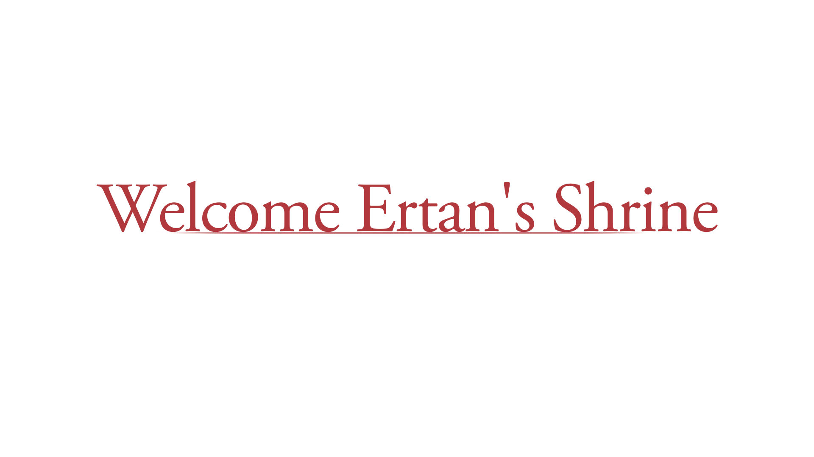

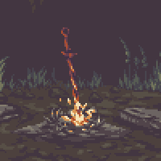

<a href="https://gifer.com/en/CKjl" target="_blank">
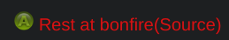
</a>

---

<ul align="left">
 
 <li> 👋 Hi, my name is Burak. Junior developer who currently work with C\# language.</li>
   
  <li>🌌 I love open source and trying to contribute projects as much as ı can. </li>
 
 <li> 🌐 Currently ı am working on backend for web applications </li>
  
 <li>🐧I love linux and  video games but they don't like each other</li>
  
 <li>📄 Last project ı finished <a href="https://github.com/Ertan222/SmileyMeow">SmileyMeow</a></li>
  
 <li>Currently working on <a href="https://github.com/Uzay-Sakinleri/afet-hayvan">Afet Hayvan</a></li>
  
 <li>
    💡 Learning/Improving <a href="https://astro.build/">Astro</a>
 </li>
   
<section align="right">

</section>

</ul>

---

<h2 align="center">Development</h2>
<h3 align="center">Language</h3>

C# is my first programming language for development. Have a important place in my life beacuse ı learned so many basic from it and my first backend development language.

 
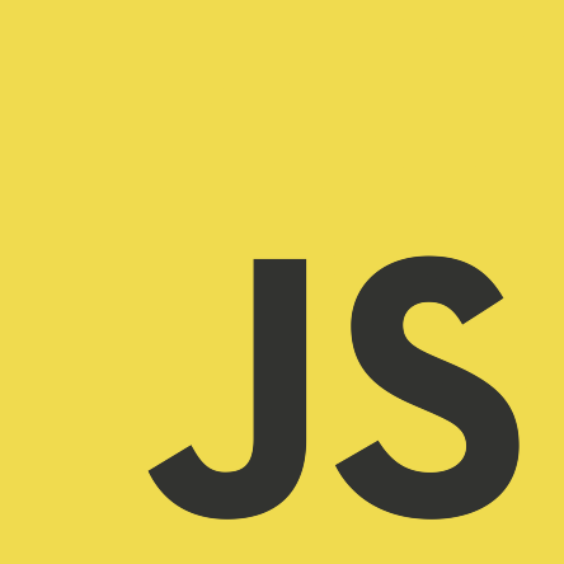

JavaScript is also important for my life beacuse gave me the confidence of using a programming languages. I usually using in backend but ı tried in frontend and its enjoyable.

 
 
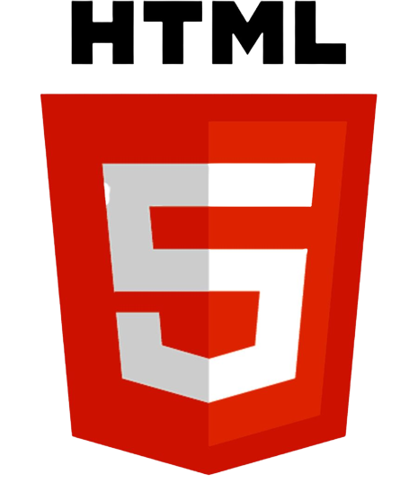

What can ı say about HTML? Basic structre of the internet, most important part of the websites. My first language for web development when ı was 15-16. Old but still helping us to build new applications.

 
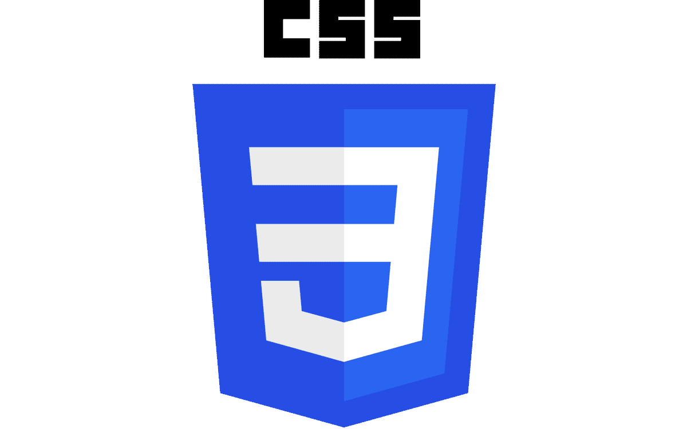

CSS, hmm... Important for web development to show better applications, we want to see colors, spacing, layouts, etc and CSS Bob Ross for our problems. I am enjoying when decide which color should ı choose

 
 
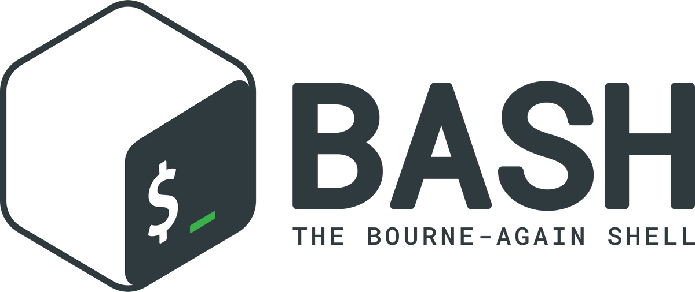

Bash scripts is very important for me. I love automation and less work like every developer and bash scripts is part of mine beacuse of that. With few lines, you can make awesome systems.

 
<h3 align="center">Databases</h3>

MongoDB is my first and favorite nosql db. I think it flexable and a good db. When ı learned about RDB first time, ı thought nosql is not that good but mongodb changed my mind. 

 

Postgres is my favorite RDB beacuse of being free, open-source, strong, secure, have a good drivers for developers and functions/procedures are also nice. I am still learning, in the future going to use directly sql from my applications cause of security, faster and flexable.

 
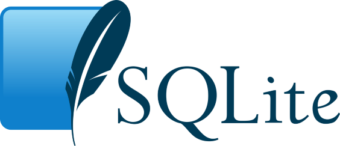

SQLite is always a good choice for side projects. You don't need to setup to use, just make a short connections string and thats it. Easy to use and ı think everyone should try it.

 
 
<h3 align="center">Tools and Systems</h3>

Git is a powerful tool to have in hand. I can track of my app's states, revert it, making messages with commits and can try new things without broking my app.

 

Hi Tux 👋, Tux is linux kernel's mascot (with xenia). Linux is my main, favorite os for development. I also use daily and having so much fun with it. I am a terminal person and using my computer with terminal more powerful and fun. But bad for video games 😔 

 
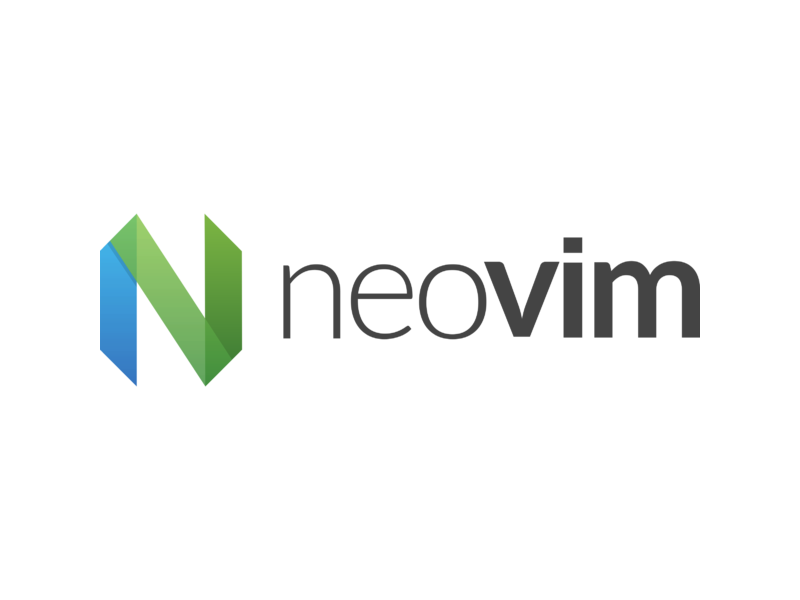

Vim and Neovim is my favorite and main text editor for daily use and for future maybe coding editor. I am using VSCode for now. 

 
<h1 align="center">Stats</h1>

