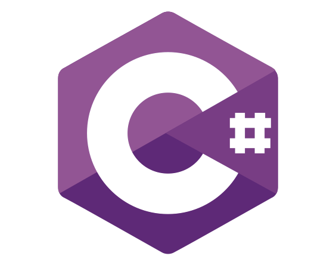
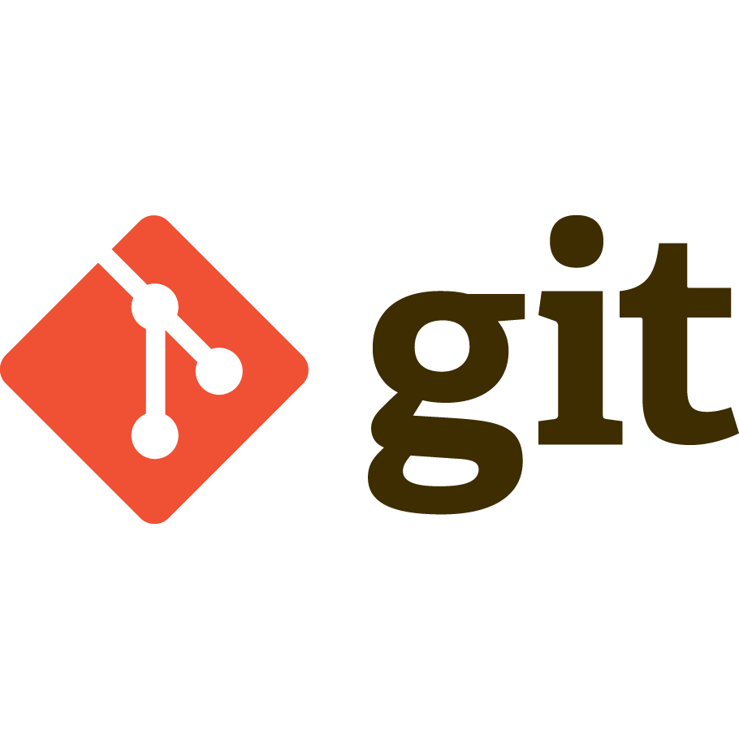

<section align="center">
<h1 class="wlcom-h">Welcome to my shrine</h1>

<figure>
<figcaption>

Rest at bonfire(Source)
</figcaption>
</figure>

Hi, my name is Ertan. I am a backend developer and open source lover.

</section>

<section align="center" class="cntc-sec">
<h2 class="cntc-h">Contact with me</h2>

<h2 class="cntc-h">Github Stats</h2>

</section>

<section>

Languages, Technologies and Tools

<table class="lng-tls-tbl">
<thead>
<tr>
<th>Name</th>
<th>Alias</th>
</tr>
</thead>
<tbody>
<tr>
<td><a href="https://learn.microsoft.com/en-us/dotnet/csharp" target="_blank" class="no-dec cshrp">C# </td>
<td>CHashtag</td>
</tr>
<tr>
<td><a href="https://developer.mozilla.org/en-US/docs/Web/JavaScript" class="no-dec js" target="_blank">Javascript </td>
<td>NaN is a number??</td>
</tr>
<tr>
<td><a href="https://developer.mozilla.org/en-US/docs/Web/HTML" class="no-dec html" target="_blank">HTML </td>
<td> of internet</td>
</tr>
<tr>
<td>
<a href="https://developer.mozilla.org/en-US/docs/Web/CSS" class="no-dec css" target="_blank">CSS </td>
<td>

<blockquote class="fam-quot" cite="https://blog.calm.com/blog/the-10-greatest-bob-ross-quotes-of-all-time">“I really believe that if you practice enough, you could paint The Mona Lisa with a two-inch brush.”</blockquote>
</td>
</tr>
<tr>
<td><a href="https://www.w3schools.com/sql/" class="no-dec sql" target="_blank">SQL </td>
<td>(S)elect (Q)uery (L)anguage</td>
</tr>
<tr>
<td><a href="https://git-scm.com/" class="no-dec git" target="_blank">Git </td>
<td><blockquote>The stupid content tracker</blockquote>Linus Torvalds</td>
</tr>
<tr>
<td><a href="https://www.gnu.org/software/bash/" class="no-dec bash-script" target="_blank">BashScript</td>
<td>Favorite scripts are: rm -rf /* and :(){ :|:& };: (Don't try at home)</td>
</tr>
<tr>
<td><a href="https://www.mongodb.com/" class="no-dec mongodb" target="_blank">MongoDb</td>
<td>Yes mom, I am eating my vegetables</td>
</tr>
<tr>
<td><a href="https://www.postgresql.org/" class="no-dec psql" target="_blank">PostgreSQL</td>
<td>Who have a blue skin, big body and strong teeths? Thats's right, cookie monster</td>
</tr>
<tr>
<td><a href="https://www.kernel.org/" class="no-dec linux" target="_blank">Linux</td>
<td><blockquote>It's actually GNU/Linux</blockquote>Richard Stallman</td>
</tr>
</tbody>
</table>
</section>